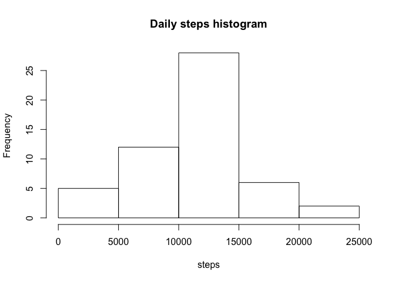
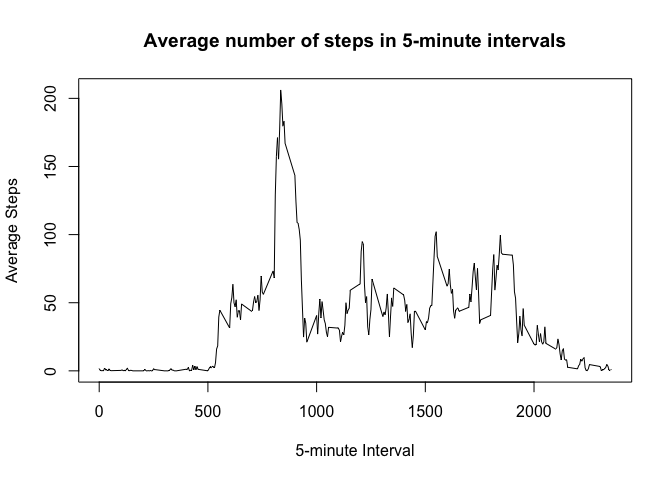
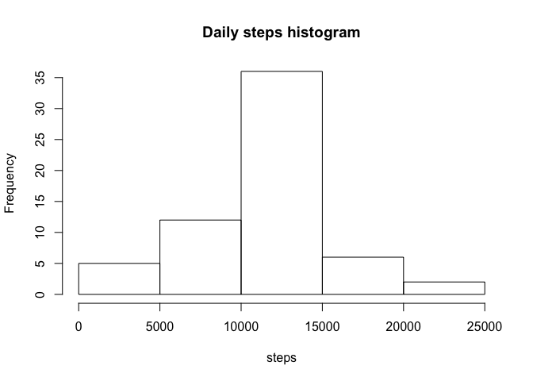

# Reproducible Research: Peer Assessment 1

## Loading and preprocessing the data

### 1. Load the data

We are going to unzip the data found in the repository path using *utils* library, and load that data into a data.frame.


```r
library(utils)
setwd("~/src/RepRes/RepData_PeerAssessment1/")
unzip("activity.zip", overwrite = TRUE)
tab <- read.csv("activity.csv")
head(tab)
```

```
##   steps       date interval
## 1    NA 2012-10-01        0
## 2    NA 2012-10-01        5
## 3    NA 2012-10-01       10
## 4    NA 2012-10-01       15
## 5    NA 2012-10-01       20
## 6    NA 2012-10-01       25
```

### 2. Process/transform the data (if necessary) into a format suitable for your analysis

We make sure dates are from the Date class.


```r
tab$date <- as.Date(as.character(tab$date))
```

## What is mean total number of steps taken per day?

### 1. Calculate the total number of steps taken per day


```r
stepsAday <- with(na.omit(tab), tapply(steps, date, sum, na.rm = T))
head(stepsAday)
```

```
## 2012-10-02 2012-10-03 2012-10-04 2012-10-05 2012-10-06 2012-10-07 
##        126      11352      12116      13294      15420      11015
```

### 2. Make a histogram of the total number of steps taken each day


```r
hist(stepsAday, main = "Daily steps histogram", xlab = "steps")
```

<!-- -->

NOTE: the difference between a barplot and a histogram is that the barplot is for categorical data, where the order of the variables does not matter, while a histogram represents continuous data in the x-axis.

### 3. Calculate and report the mean and median of the total number of steps taken per day


```r
summary(stepsAday, digits = 7)[3:4]
```

```
##   Median     Mean 
## 10765.00 10766.19
```

The mean steps per day are 1.0766189\times 10^{4} and the median steps are 10765.

## What is the average daily activity pattern?

### 1. Make a time series plot of the 5-minute interval (x-axis) and the average number of steps taken, averaged across all days (y-axis)


```r
aveSteps <- with(na.omit(tab), tapply(steps, as.factor(interval), mean))
plot(names(aveSteps), aveSteps, type = "l",
     xlab = "5-minute Interval", ylab = "Average Steps",
     main = "Average number of steps in 5-minute intervals")
```

<!-- -->

### 2. Which 5-minute interval, on average across all the days in the dataset, contains the maximum number of steps?


```r
data.frame(interval = names(which.max(aveSteps)), steps = max(aveSteps))
```

```
##   interval    steps
## 1      835 206.1698
```

The interval number 835 contains the maximum average steps across all days in the dataset with a mean of 206.1698113 steps.

## Imputing missing values

### 1. Calculate and report the total number of missing values in the dataset


```r
sum(is.na(tab))
```

```
## [1] 2304
```

Total number of missing values in the dataset is 2304.

### 2. Devise a strategy for filling in all of the missing values in the dataset. The strategy does not need to be sophisticated. For example, you could use the mean/median for that day, or the mean for that 5-minute interval, etc.

We'll use the mean for the 5-minute interval rounded to 0 decimal places to fill in missing values.

### 3. Create a new dataset that is equal to the original dataset but with the missing data filled in.


```r
tab2 <- tab
cnd <- is.na(tab2$steps)
tab2$steps[cnd] <- round(aveSteps[as.character(tab2$interval[cnd])])
head(tab2)
```

```
##   steps       date interval
## 1     2 2012-10-01        0
## 2     0 2012-10-01        5
## 3     0 2012-10-01       10
## 4     0 2012-10-01       15
## 5     0 2012-10-01       20
## 6     2 2012-10-01       25
```

### 4. Make a histogram of the total number of steps taken each day and Calculate and report the mean and median total number of steps taken per day.


```r
stepsAday2 <- with(tab2, tapply(steps, date, sum, na.rm = T))
hist(stepsAday2, main = "Daily steps histogram", xlab = "steps")
```

<!-- -->


```r
summary(stepsAday2, digits = 7)[3:4]
```

```
##   Median     Mean 
## 10762.00 10765.64
```

The mean steps per day are 1.0765639\times 10^{4} and the median steps are 1.0762\times 10^{4}.

#### Do these values differ from the estimates from the first part of the assignment? What is the impact of imputing missing data on the estimates of the total daily number of steps?

These values are slightly lower than in the first part of the assignment but do not alter the result dramatically.

## Are there differences in activity patterns between weekdays and weekends?

### 1. Create a new factor variable in the dataset with two levels <U+2013> <U+201C>weekday<U+201D> and <U+201C>weekend<U+201D> indicating whether a given date is a weekday or weekend day.


```r
Sys.setlocale("LC_ALL","C")
```

```
## [1] "C/C/C/C/C/ca_ES.UTF-8"
```

```r
dayType <- rep("weekday", nrow(tab2))
dayType[weekdays(tab2$date, abbreviate = T) %in% c("Sat", "Sun")] <- "weekend"
tab2$dayType <- factor(dayType)
head(tab2)
```

```
##   steps       date interval dayType
## 1     2 2012-10-01        0 weekday
## 2     0 2012-10-01        5 weekday
## 3     0 2012-10-01       10 weekday
## 4     0 2012-10-01       15 weekday
## 5     0 2012-10-01       20 weekday
## 6     2 2012-10-01       25 weekday
```

### 2. Make a panel plot containing a time series plot of the 5-minute interval (x-axis) and the average number of steps taken, averaged across all weekday days or weekend days (y-axis).


```r
library(ggplot2)
library(reshape2)
aveSteps2 <- with(na.omit(tab2),
                  tapply(steps, list(as.factor(interval), dayType), mean))
aveSteps2 <- melt(aveSteps2, varnames = c("interval", "dayType"),
                  value.name = "averageSteps")
ggplot(aveSteps2) + geom_line(aes(interval, averageSteps)) +
  facet_grid(dayType~.) + ylab("Number of steps") + xlab("Interval")
```

<!-- -->

We see that in weekdays there is a peak of steps in the morning until around 10 AM, while on weekends the steps are more evenly distributed across the day.
